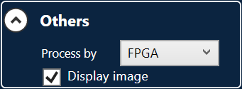
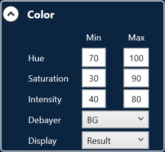

# VisualApplets
This is C# demonstration for visual applets.

## Algorithm
Do hue saturation intensity threshold for color classification. 

## Installation
1. Build visual applets as hap file.
2. Edit camera size. Depend on the camera, the camera width is **multiple of 64**  for boost V camera( Check it in microDisplayX ). The image size of visual applets is **multiple of 24**. So the width must be **least common multiple of 24 and 64**. LCM( 24, 64) = 192.
https://github.com/BaslerTwSupport/VisualApplets/blob/92116e1b0b85b49ec61d65de7ce76919356f0158/Main/ViewModels/MainViewModel.cs#L320
3. Change name to built hap file.
https://github.com/BaslerTwSupport/VisualApplets/blob/3587b96027e5846b994366c30dbdfa713926f36d/Main/ViewModels/MainViewModel.cs#L321

## Navigation
1. Select **Process by** to **FPGA** in in expander **Others**.

2. Select **Debayer** to right format as camera in expander **Color**.

3. Switch **Display** to **Hue**, **Saturation** and **Intensity**. Check the value of specific color that you want to classify.
4. Set threshold of **Hue**, **Saturation** and **Intensity**.
5. Check result by switch **Display** to **Result**.
6. Select **Process by** to **CPU** in in expander **Others**. Do it again as step 1 to step 5.
The parameters will save to **System.xml** after closed application.
